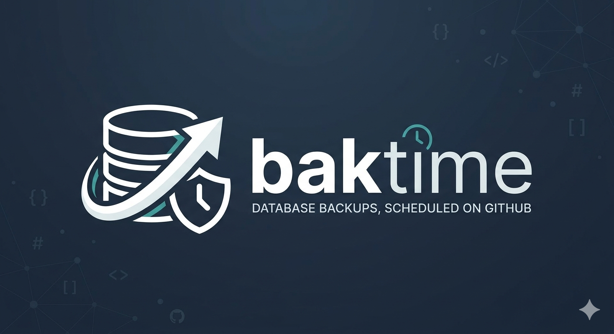

> **The "Upptime" for backups.** GitHub Actions does the work, [restic](https://restic.net/) does the backing up, and a Cloudflare Worker exists only to trigger it reliably on a schedule.

baktime backs up MySQL/Postgres databases and files on remote hosts
reachable over SSH. Like [upptime](https://github.com/upptime/upptime), this
repo is a **GitHub template**: click "Use this template" to create your
own private instance, the same way
[`mleczakm/infrastructure-status`](https://github.com/mleczakm/infrastructure-status)
is an instance of `upptime/upptime`.

## How it's different from upptime

Uptime pings are tiny and safe to commit to a public repo. Backup data
isn't. So git only ever stores config and run history — the actual backup
bytes live in a restic repository (Cloudflare R2 by default, or any
restic-supported backend), and **targets themselves are never committed at
all**: which hosts and databases get backed up, and on what schedule, is
defined entirely by GitHub secrets, the same way upptime configures
notification channels rather than its plain `sites:` list. Adding or
removing a target is a "add/remove a secret" operation, no PR needed. See
[`docs/architecture.md`](docs/architecture.md) for the full design and why.

## How it works

```
sync-cloudflare-schedule.yml   → projects {name, type, schedule} from secrets into Cloudflare KV
Cloudflare Worker (cron)       → reads KV, fires repository_dispatch only for targets actually due
backup.yml                     → re-derives the target from secrets, backs it up, commits history/*.yml
```

For file targets, restic runs *on the target host* itself (self-installed
over SSH, no root, works on Alpine and glibc alike) so its incremental
dedup carries over between runs and file bytes never transit the Actions
runner. Database targets stream `mysqldump`/`pg_dump` straight into
`restic backup --stdin` from the runner instead, since many databases
offer no shell access to install anything on.

## Status

Built: config schema, secrets-driven dynamic target discovery, cron-based
scheduling, complete `files` and `mysql`/`postgres` backup paths end to
end, a local-filesystem restic backend option, Discord backup
success/failure notifications (more providers to come — configured the
same secrets-driven way as everything else), and the schedule-aware
Cloudflare Worker. The status site, retention/pruning, and restore
verification are designed but not yet built — see
[`ROADMAP.md`](ROADMAP.md).

## Getting started

See [`docs/getting-started.md`](docs/getting-started.md).

## Documentation

- [`docs/getting-started.md`](docs/getting-started.md) — set up your own instance
- [`docs/config-reference.md`](docs/config-reference.md) — `.baktimerc.yml` and target JSON reference
- [`docs/secrets.md`](docs/secrets.md) — exactly which secrets to create and how to scope them
- [`docs/architecture.md`](docs/architecture.md) — the full design, and why it differs from upptime where it does
- [`ROADMAP.md`](ROADMAP.md) — what's built vs. designed-but-not-yet-built

---
*Architecture inspired by [upptime](https://github.com/upptime/upptime); backup engine is [restic](https://restic.net/).*
