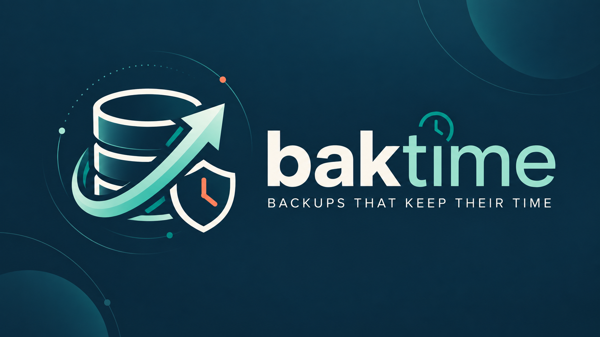

> **Scheduled, encrypted, deduplicated backups of your servers, databases and files — run by GitHub Actions, with no backup server to maintain.**

Explore the [baktime project homepage](https://baktime.github.io/) for an overview of how it works and what you get. If the project is useful, [say thanks on Suppi](https://suppi.pl/mleczakm).

baktime is a GitHub template repository. You create your own **private**
copy of it, add each thing you want backed up as a GitHub secret, and from
then on GitHub Actions backs it up on its schedule into a
[restic](https://restic.net/) repository — Cloudflare R2 by default, or any
S3-compatible or restic-supported storage.

It backs up:

- **Files** on any Linux host reachable over SSH (Alpine or glibc, no root
  needed) — including transactionally consistent copies of live SQLite
  databases.
- **MySQL and PostgreSQL** databases, connected directly or through an SSH
  tunnel via a jump host.

## What you get

- **Schedules per target** — any cron expression, evaluated in UTC.
- **Encrypted, deduplicated, incremental storage** — restic encrypts
  everything client-side; only changed data is uploaded.
- **Retention** — e.g. keep 14 daily, 8 weekly and 12 monthly snapshots;
  older ones are forgotten and pruned daily.
- **Run history in git** — every run is recorded in `history/<target>.yml`
  (time, duration, snapshot id, bytes added, errors), never the data itself.
- **Status page** — every target's health (healthy / late / failing /
  never run) and recent runs, served by a small Cloudflare Worker.
- **Notifications** — a Discord message on every backup success or
  failure, plus a weekly report with health, snapshot counts and storage
  used.
- **Restores** — a manual workflow restores a database snapshot in place
  (after taking a safety backup first), or a files snapshot into a staging
  directory on its host.

## How it works

```
GitHub secrets        one BAKTIME_TARGET_<NAME> JSON secret per target (+ its SSH key / DB password secrets)
  │
  ├─ sync-cloudflare-schedule.yml   every 15 min: copies each target's name + schedule (nothing sensitive) into Cloudflare KV
  │
Cloudflare Worker                   every 5 min: checks which targets are due and triggers backup.yml for exactly those
  │
  └─ backup.yml                     reads the target from secrets, runs the backup, commits history/<target>.yml
       ├─ files target:     SSH to the host, install a checksum-verified restic there, run `restic backup` on the host
       └─ database target:  `mysqldump` / `pg_dump` on the runner, streamed straight into `restic backup --stdin`

prune.yml     daily: `restic forget` per target by its retention policy, then `prune` + `check`
summary.yml   weekly: health and storage report to your notification channels
site.yml      after each history commit: rebuilds the status page
restore.yml   manual: restore a snapshot
```

The main design decisions:

- **Targets live in secrets, not in git.** Which hosts and databases you
  back up is itself sensitive, so the committed config (`.baktimerc.yml`)
  holds only non-sensitive instance settings. Adding or removing a target
  means adding or removing a secret — no commit needed.
- **File data never passes through GitHub.** restic runs on the host being
  backed up and talks to storage directly, so large file trees stay fast
  and incremental.
- **Database dumps are never written to disk** — they're streamed from the
  dump tool into restic, which also works for managed databases you can't
  install anything on.
- **The Worker exists only for reliable timing.** GitHub's own `schedule:`
  trigger can be delayed or skipped under load; the Worker is a tiny,
  stateless dispatcher.

See [`docs/architecture.md`](docs/architecture.md) for the full design.

## Getting started

You need a GitHub account, a Cloudflare account (for R2 storage and the
Worker) and SSH access to what you want to back up. Follow
[`docs/getting-started.md`](docs/getting-started.md).

## Documentation

- [`docs/getting-started.md`](docs/getting-started.md) — set up your own instance
- [`docs/config-reference.md`](docs/config-reference.md) — `.baktimerc.yml`, target JSON and retention reference
- [`docs/secrets.md`](docs/secrets.md) — which secrets to create and how to scope them
- [`docs/architecture.md`](docs/architecture.md) — the full design and its trade-offs
- [`docs/rollback.md`](docs/rollback.md) — restoring database and files snapshots
- [`ROADMAP.md`](ROADMAP.md) — what's built and what's planned (next: automated restore drills)

---
*Inspired by [upptime](https://github.com/upptime/upptime)'s "the GitHub repo is the whole app" approach; backups by [restic](https://restic.net/).*
